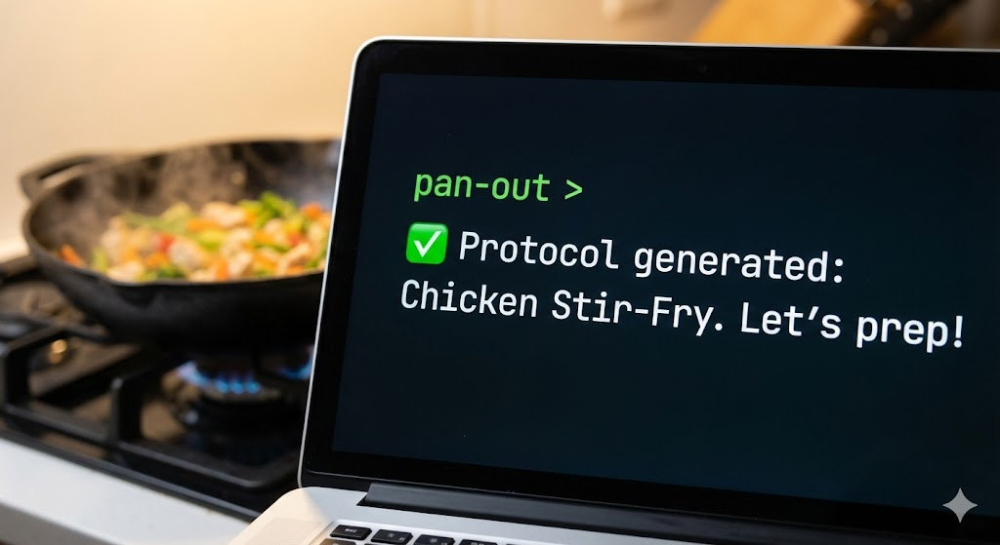

# Your AI sous-chef, in the terminal.

You want to make a proper bolognese — the kind that actually tastes like it came from a kitchen that knows what it's doing. You know the basics, but you don't want to wing it from a blog recipe and hope for the best. You want to understand *why* the sear matters, be told (in words, not beeps!) when it's time to flip, swap out an ingredient without ruining the dish, and come out the other side knowing more than when you started.

That's what Pan Out does. It's a free, open-source set of AI skills for [Claude Code](https://claude.ai/claude-code) that handle the full arc of cooking a dish:

{: .green }
> ## 👋 Set up your kitchen
>
> **Say `/panout-help` to get started.** Pan Out learns about your kitchen — what you cook on, the tools you reach for, whether you have a probe thermometer — and builds a cook profile that every skill uses to tailor its guidance. It also offers optional sensor calibration so temperature calls stay accurate. After that, `/panout-help` is your compass: describe what you want to do and it routes you to the right skill.

{: .yellow }
> ## 🔬 Research it
>
> **[Build a protocol.](first-recipe.html)** You name a dish. Pan Out pulls from recipes, food science, and technique guides, cross-validates temperatures and times, and compiles everything into a step-by-step protocol tuned to your kitchen, your equipment, and your preferences — alongside a companion science reference that captures the "why" behind every decision.

{: .blue }
> ## 🔪 Cook it
>
> **[Cook with your protocol.](first-cook.html)** Before anything hits the pan, it asks what you're working with — a kilo of chuck, half a bag of onions, feeding two or feeding ten. It adjusts the entire plan to match. Then at the stove, Pan Out becomes your sous-chef — it stays one step ahead of you, tells you what to do next, watches the timers, checks your temperatures, and tells you what to look for instead of just how long to wait. When you're braising for two hours, it tells you to walk away, gives you spoken progress updates so you know it's still on it, and calls you back when something needs attention. You can snap photos mid-cook too — they're saved with the session for the debrief.

{: .purple }
> ## 📈 Learn from it
>
> **[Debrief and improve.](after-you-cook.html)** After you eat, a quick debrief captures what worked and what didn't. Timing adjustments, technique discoveries, seasoning preferences — all written back into the protocol so next time starts where this time left off. Lessons also accumulate in a memory system that spans dishes, so what you learn making a stew carries over when you braise short ribs.

The system is built around **protocols** — structured recipe files that hold everything needed to cook a dish. They're not static recipes. They're living documents that get better every time you cook.

---

Two minutes to set up. [Install Pan Out →](install.html)
